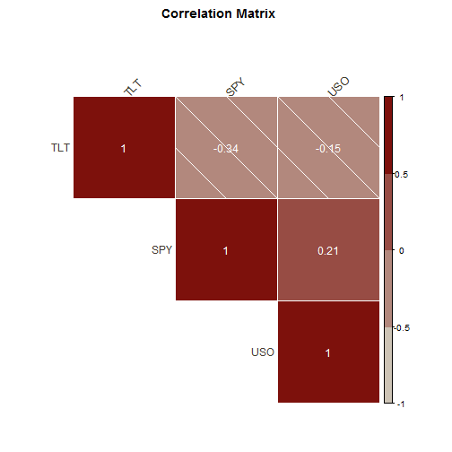

## What

Securities Matrix Correlation allows to generate a matrix containing the correlations
among the different entered securities.

Each of them will be placed in the intersection cell between the security in the row and the 
security in the column.

---
## Why

When building a stock portfolio, is important to know how correlated are the different stocks or funds.

A diversified portfolio (low correlation among its stocks) will have much less risk for the same amount of expected return than a non-diversified portfolio (high correlation among its stocks)

---
## How

The only information required to the user for the calculation will be:
- A list of securities separated by comma
- The period in which the correlation should be calculated.

Once the application has this information, it will request the returns information for each security through the package "stockPortfolio". These returns will be calculated weekly.

Once we have these returns, the app will calculate the covariance matrix, measuring the variance of the returns of one security against the other each week.

Finally, this covariance will be normalized in the correlation matrix.

---
## Where

The application can be run from the url: <a href="https://alfil.shinyapps.io/correlation_matrix/">https://alfil.shinyapps.io/correlation_matrix/</a>

For example, if we calculate it for the securities TLT, SPY and USO. We would obtain:
        
 

